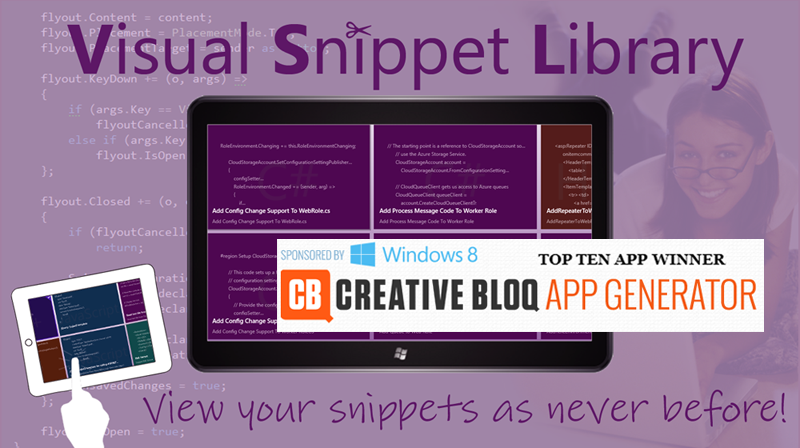
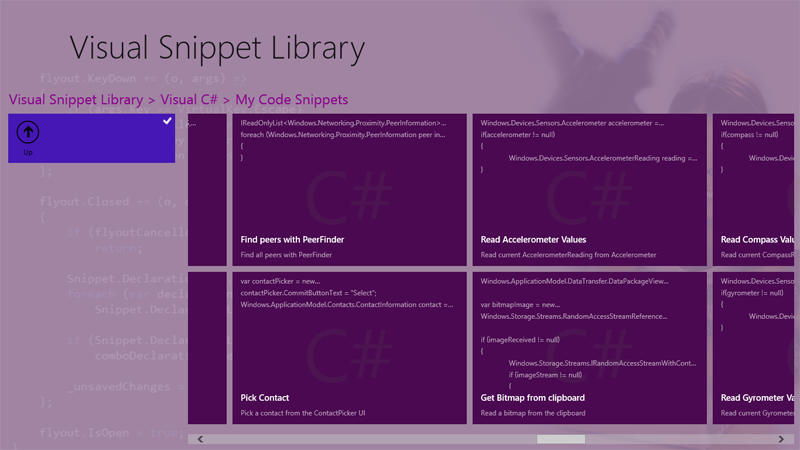
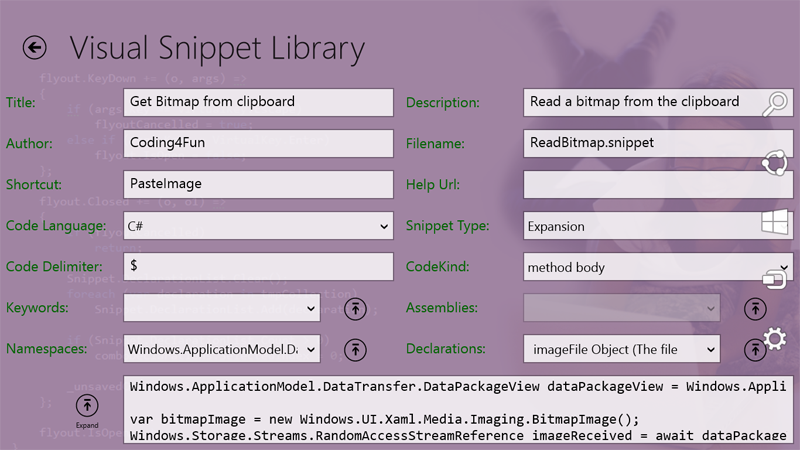
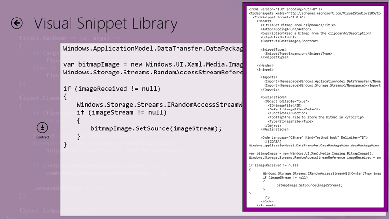
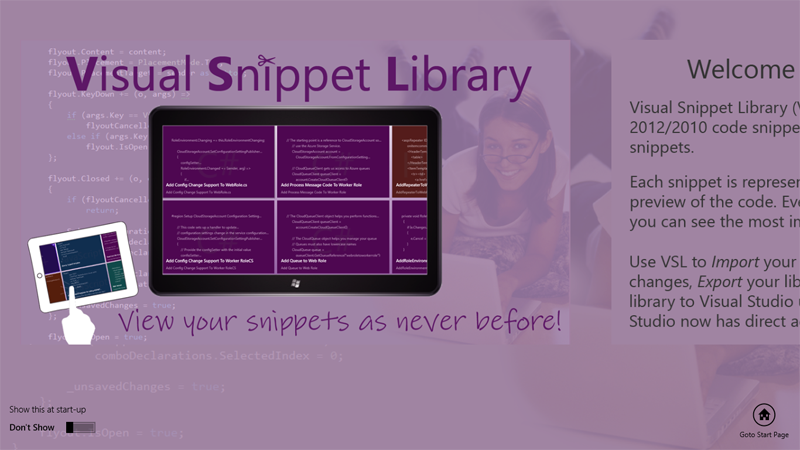
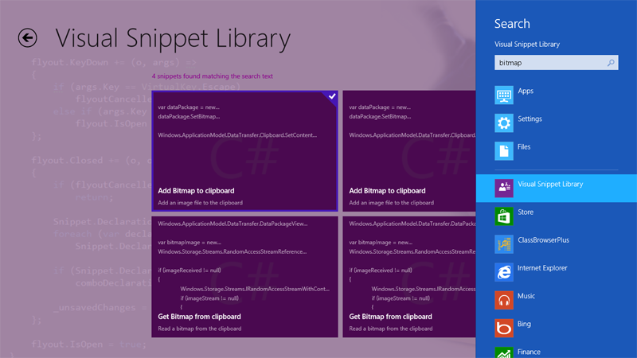

# VisualSnippetLibrary

**Archived Visual Studio 2013 project that was previously held in Team Foundation Server**

Visual Snippet Library is a Windows 8 Developer's utility that unlocks the hidden gems in Visual Studio code snippets!

## App Features
Visual Snippet Library allows you to open-up your Visual Studio code snippet library so you can quickly browse, search, view, edit and create snippets. Each snippet is represented as a tile, with a live-preview of the code. And every code language has a color-coded background, so you can see the most important snippet properties at a glance.

**In February 2013 Visual Snippet Library was a Top-10 App Winner in the Microsoft Windows 8 Creative Bloq App Generator competition!**

* Browse Visual Studio code snippets with at-a-glance code previews
* Manage your collection of code snippets with ease
* Easily create and edit snippets in a friendly environment
* Finally, an easy way to search and filter your code snippets!
* Import and Export to/from Visual Studio

## Screenshots

## Support Information
The latest version (1.00) of Visual Snippet Library is available from the Windows Store.

Visual Snippet Library was designed to run on any Windows 8-compatible device.
